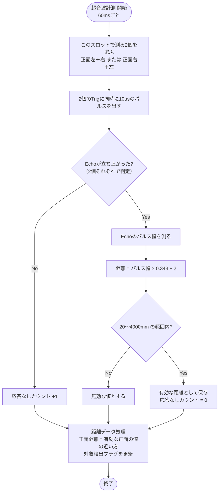

# 01 超音波計測

超音波センサ HC-SR04 ×4個（正面2個：中心から±48.9 mm・外向き7.5°、左右2個：前の角・外向き30°）で距離を測り、他のモジュールが使える形に整える。

関連要件：FR-01, FR-02, IF-01

## 機能モジュール表

| 機能モジュール名 | 機能モジュールの役割 | 入力 | 出力 | 動作の仕様 | 関連モジュール |
|---|---|---|---|---|---|
| 超音波計測 | 向きの離れた2個ずつ同時に動かし、距離を求める | Echo信号（4個） | 各センサの距離 [mm] 応答なしフラグ（センサごと） | 60 msごとに「正面左＋右」→「正面右＋左」を交互に測る（1周120 ms） Trigに10 µsのパルスを出し、Echoのパルス幅をタイマで測る 距離 = パルス幅 [µs] × 0.343 ÷ 2 Echoが立ち上がらなければ「応答なし」 | 距離データ処理 エラー検出 |
| 距離データ処理 | 測った距離から使える値だけを選んでまとめる | 各センサの距離 [mm] | 正面距離 [mm] 正面左・正面右・左・右の距離 [mm] 対象検出フラグ | 新しい値が入るたびに更新 20〜4000 mm の範囲外は無効 正面距離 = 正面2個のうち有効な値の近い方 どれかが300 mm以内を検出していれば対象検出ON | 位置制御 向き制御 障害物検知 見失い判定 |

## 測定の順番とサンプリングの速さ（2026-10-02 決定）

同じ40 kHzの音を使うため、向きが近いセンサ（正面左と正面右）は同時に鳴らさない。向きが37.5°以上離れた組（正面左＋右、正面右＋左）は音の範囲が重ならない見込みなので同時に測る。

| スロット（60 ms） | 同時に測るセンサ |
|---|---|
| 1 | 正面左 ＋ 右 |
| 2 | 正面右 ＋ 左 |

| 項目 | 間隔 | 周波数 |
|---|---|---|
| 1スロット | 60 ms | 約16.7 Hz |
| 1周（2スロット） | 120 ms | 約8.3 Hz |
| 各センサ（4個とも） | 120 ms | 約8.3 Hz |
| 正面距離の更新（＝位置制御の計算） | 60 ms | 約16.7 Hz |

- 1スロットを60 msより短くしない（物がないとEchoが最大約38 ms出続け、前の反響を拾うおそれがあるため）。
- **実機で干渉テストを行う**：片方だけ鳴らし、もう片方が反応しないかを、板の角度を変えて確認する。干渉が出たら、1個ずつ測る順番（正面左→正面右→左→正面左→正面右→右、1周360 ms、正面距離の更新は平均90 ms・最大120 ms）に戻す。
- 測る順番はプログラム内の表で決め、書き換えるだけで切り替えられるようにする。

## 補足

- 正面距離（近い方）は、位置制御の「追従対象距離取得」と障害物検知で共通に使う。
- 2個同時に測るため、Echoは外部割込み（立ち上がり・立ち下がり）で受け、TIM2の時刻からパルス幅を求める。
- Echoは5 Vが出るため、5 V耐性のあるピンにつなぐ。

## フローチャート

