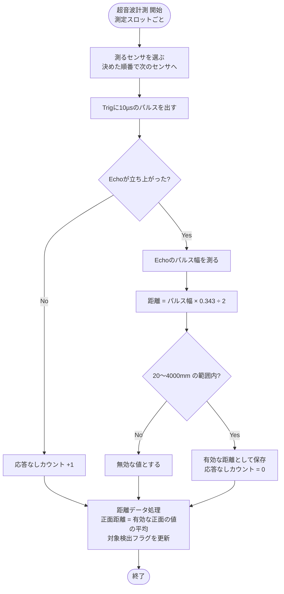

# 01 超音波計測

超音波センサ HC-SR04 ×4個（正面2個：中心から±48.9 mm・外向き7.5°、左右2個：前の角・外向き30°）で距離を測り、他のモジュールが使える形に整える。

関連要件：FR-01, FR-02, IF-01

## 機能モジュール表

| 機能モジュール名 | 機能モジュールの役割 | 入力 | 出力 | 動作の仕様 | 関連モジュール |
|---|---|---|---|---|---|
| 超音波計測 | 4個のセンサを1個ずつ順番に動かし、距離を求める | Echo信号（4個） | 各センサの距離 [mm] 応答なしフラグ（センサごと） | 1個ずつ順番に測る（同時に鳴らすと干渉するため） Trigに10 µsのパルスを出し、Echoのパルス幅をタイマで測る 距離 = パルス幅 [µs] × 0.343 ÷ 2 Echoが立ち上がらなければ「応答なし」 | 距離データ処理 エラー検出 |
| 距離データ処理 | 測った距離から使える値だけを選んでまとめる | 各センサの距離 [mm] | 正面距離 [mm] 正面左・正面右・左・右の距離 [mm] 対象検出フラグ | 新しい値が入るたびに更新 20〜4000 mm の範囲外は無効 正面距離 = 正面2個のうち有効な値の平均（片方だけ有効ならその値） どれかが300 mm以内を検出していれば対象検出ON | 位置制御 向き制御 障害物検知 見失い判定 |

## 補足・未確定事項

- 測る順番と1回の測定時間は TBD。要件定義書8.1節の提案（前1→前2→左→前1→前2→右、1回約30 ms）と、選定ログの値（1個60 ms、1周240 ms）をそろえて決める。
- 正面距離の平均は、位置制御の「追従対象距離取得」ではなくこのモジュールで計算する。
- Echoは5 Vが出るため、5 V耐性のあるピンにつなぐ。

## フローチャート

