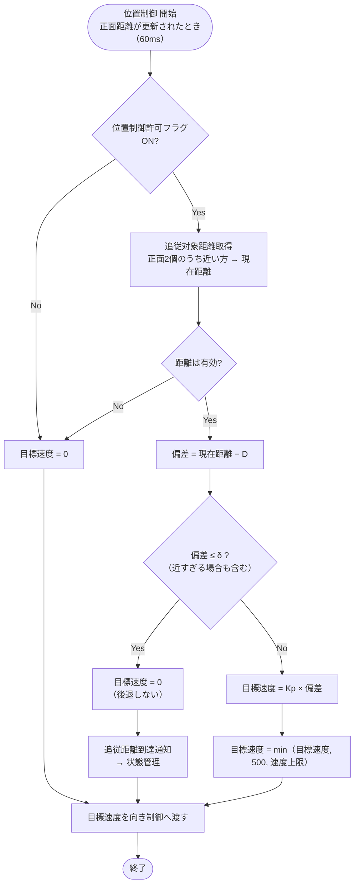

# 02 位置制御

追従対象（利用者が持つ板）との前後方向の距離を、事前に設定した追従距離に保つ。出した目標速度は向き制御で左右に分けてから速度制御へ渡す（位置制御 → 向き制御 → 速度制御）。

関連要件：FR-03, FR-04, NFR-03

## 決定事項（2026-10-02）

| No. | 項目 | 決定 |
|---|---|---|
| 1 | 後退 | **しない**。目標速度は0以上に制限し、追従距離より近いときは止まる |
| 2 | 距離が測れないとき | 見失い判定が出るまでの間も、**すぐ目標速度0** にする（安全側） |
| 3 | 現在距離の定義 | 正面2個のうち**近い方**の値（片方が奥の壁などを測っても、ぶつかる方向に間違えないため） |
| 4 | 計算のタイミング | 正面距離が更新されるたび（**60 msごと**、[01 超音波計測](01_ultrasonic.md)参照） |
| 5 | 目標速度の上限 | min（Kp × 偏差, **500 mm/s**, 障害物検知の速度上限） |
| 6 | 加速度の制限 | 速度制御の入口で、**加速のみ 0.3 m/s²** に制限（減速・停止は制限しない）。[04 速度制御](04_speed_control.md)参照 |
| 7 | Kp・しきい値 δ | **MATLABのシミュレーション**で決める（下の「シミュレーション」参照） |
| 8 | 遅れ対策（フィードフォワード） | **今は入れない**。シミュレーションのシナリオ2で遅れが L を超えたら追加を検討 |

## 機能モジュール表

| 機能モジュール名 | 機能モジュールの役割 | 入力 | 出力 | 動作の仕様 | 関連モジュール |
|---|---|---|---|---|---|
| 追従対象距離取得 | 追従対象までの現在距離を受け取る | 正面左・正面右の距離 [mm]（距離データ処理から） | 現在距離 [mm] 距離有効フラグ | 正面距離が更新されたとき（60 msごと）に取得 現在距離 = 正面2個のうち有効な値の近い方 2個とも無効なら距離有効フラグをOFF | 距離データ処理 位置偏差計算・位置P制御 |
| 追従距離設定 | 追従時の目標位置となる追従距離を保持する | なし（プログラム内の定数） | 目標距離 D [mm] | 事前に設定した固定値を使う（走行中に変更しない）。値は未確定（仮 100 mm） | 位置偏差計算・位置P制御 |
| 位置偏差計算・位置P制御 | 追従距離と現在距離の差から目標速度を決める | 目標距離 D [mm] 現在距離 [mm] 距離有効フラグ 速度上限 [mm/s]（障害物検知から） 位置制御許可フラグ | 目標速度 [mm/s] 追従距離到達通知 | 現在距離が更新されたときに計算 許可フラグOFF、または距離が無効なら目標速度 = 0 偏差 = 現在距離 − D 偏差 ≤ δ なら目標速度 = 0 とし到達を通知（後退しないため、マイナスの偏差も0） それ以外は 目標速度 = min（Kp × 偏差, 500, 速度上限） | 向きP制御 障害物検知 状態管理 |

## PID制御にしなかった理由（P制御のみ）

- **I（積分）が要らない**：内側の速度制御が目標速度どおりに動けば、位置は速度を積み重ねたものになり、制御対象に積分が1つ含まれる。止まっている目標ならP制御だけで偏差が0に収まる。
- **後退しないため、Iを入れると悪影響が出る**：目標速度を0以上に制限すると、止まっている間もマイナスの偏差が積分に溜まり続け（ワインドアップ）、板が離れたときに動き出しが遅れたり飛び出したりする。
- **D（微分）が使いにくい**：超音波の距離は更新間隔が長く（60 ms）、値のばらつきもあるため、微分するとノイズが大きくなる。揺れの抑制は内側の速度制御（1 ms）が担う。
- **弱点**：相手が一定速度で動き続けると「相手の速さ ÷ Kp」程度の遅れが残る（例：200 mm/s、Kp = 4 [1/s] なら約50 mm）。シミュレーションで確認する。

## シミュレーション（MATLAB）

### モデル

速度制御を一次遅れ（時定数 τ）で近似したモデルで、位置制御の Kp と δ を決める。速度制御を設計する段階で、モータの式と1 msの速度PIを入れた詳しいモデルに広げる。

| 要素 | 内容 |
|---|---|
| 速度制御 | 一次遅れ 1/(τs + 1)。τ は仮 0.1 s（実機で速度のステップ応答を測って差し替える） |
| 距離の更新 | 60 msごとのサンプル＆ホールド |
| センサの分解能 | 約3 mm |
| 目標速度の制限 | 0〜500 mm/s、障害物検知の速度上限 |
| 加速度の制限 | 加速のみ 0.3 m/s² |
| しきい値 | δ |

### パラメータ（数字は後から変えられるようにする）

| 名前 | 意味 | 仮の値 |
|---|---|---|
| D | 追従距離 | 100 mm（未確定） |
| d_stop | 近接停止の距離 | 50 mm |
| δ | 止まったときに許すずれ | 10 mm |
| m | 近づきすぎに対する余裕 | 10 mm |
| v_t | 試験で板を動かす速さ | 200 mm/s |
| L | 追従中に許す遅れ | 50 mm |

### 合格基準

| No. | シナリオ | 合格基準 |
|---|---|---|
| 1 | 3D先の止まった板に近づく | 止まったときの距離が D ± δ 以内。最接近でも d_stop + m 以上 |
| 2 | 板が v_t で一定に離れていく | ついていく距離が D + L 以下に落ち着く |
| 3 | v_t で追従中に、板が急に止まる | 最接近でも d_stop + m 以上 |
| 4 | 1〜3すべて | 発進と停止を細かく繰り返さない |

D は d_stop + m より十分大きくないとシナリオ3を満たせない（追従距離を決めるときの条件になる）。

## 未確定事項

- 追従距離 D の値
- Kp、δ（シミュレーションで決める）
- 速度制御の時定数 τ（実機で測る）

## フローチャート

