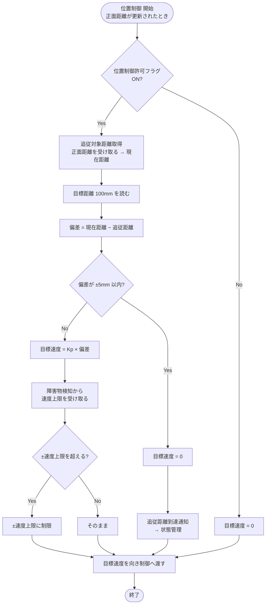

# 02 位置制御

追従対象（利用者が持つ板）との前後方向の距離を、事前に設定した追従距離に保つ。出した目標速度は向き制御で左右に分けてから速度制御へ渡す（位置制御 → 向き制御 → 速度制御）。

関連要件：FR-03, FR-04, NFR-03

## 機能モジュール表

| 機能モジュール名 | 機能モジュールの役割 | 入力 | 出力 | 動作の仕様 | 関連モジュール |
|---|---|---|---|---|---|
| 追従対象距離取得 | 追従対象までの現在距離を受け取る | 正面距離 [mm]（距離データ処理から） | 現在距離 [mm] | 正面距離が更新されたときに取得 （正面2個の平均は距離データ処理で計算済み） | 距離データ処理 位置偏差計算・位置P制御 |
| 追従距離設定 | 追従時の目標位置となる追従距離を保持する | なし（プログラム内の定数） | 目標距離 [mm] （追従距離 = 100 mm） | 事前に設定した固定値を使う（走行中に変更しない） | 位置偏差計算・位置P制御 |
| 位置偏差計算・位置P制御 | 追従距離と現在距離の差から目標速度を決める | 目標距離 [mm] 現在距離 [mm] 速度上限 [mm/s]（障害物検知から） 位置制御許可フラグ | 目標速度 [mm/s] 追従距離到達通知 | 現在距離が更新されたときに計算 偏差 = 現在距離 − 追従距離 目標速度 = Kp × 偏差 目標速度は ±速度上限 で制限（最大 500 mm/s） 偏差が ±5 mm 以内なら目標速度0とし到達を通知 | 向きP制御 障害物検知 状態管理 |

## PID制御にしなかった理由（P制御のみ）

- **I（積分）が要らない**：内側の速度制御が目標速度どおりに動けば、位置は速度を積み重ねたものになり、制御対象に積分が1つ含まれる。止まっている目標ならP制御だけで偏差が0に収まる。
- **D（微分）が使いにくい**：超音波の距離は更新間隔が長く、値のばらつきもあるため、微分するとノイズが大きくなる。揺れの抑制は内側の速度制御が担う。
- **注意**：相手が一定速度で動き続けると「相手の速さ ÷ Kp」程度の遅れが残る（例：200 mm/s、Kp = 4 [1/s] なら約50 mm）。気になる場合はIを足すか、相手の速さを推定して上乗せする。

## 未確定事項

- Kp、偏差のしきい値（±5 mm）、計算の周期（超音波の測る順番で決まる）
- 追従中に後退するか（偏差がマイナスのとき、この設計のままだと後退する）

## フローチャート

