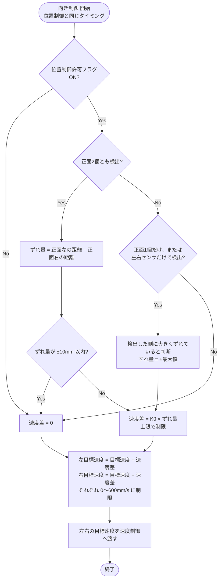

# 03 向き制御

追従対象が左右にずれたとき、左右の車輪に速度差をつけて対象の方へ向きを変える。位置制御の目標速度を受け取り、左右の目標速度に分けて速度制御へ渡す。

関連要件：FR-03, FR-11

## 機能モジュール表

| 機能モジュール名 | 機能モジュールの役割 | 入力 | 出力 | 動作の仕様 | 関連モジュール |
|---|---|---|---|---|---|
| 左右ずれ判定 | 追従対象が左右どちらにどれだけずれているかを求める | 正面左・正面右・左・右の距離 [mm] | ずれ量 [mm] （＋：右にずれ、−：左にずれ） | 新しい距離が入るたびに更新 正面2個とも検出：ずれ量 = 正面左の距離 − 正面右の距離 正面の片方だけ、または左右センサだけで検出：その側に大きくずれていると判断し、ずれ量を最大値（TBD）とする | 距離データ処理 向きP制御 |
| 向きP制御 | ずれ量から左右の車輪の速度差を決める | ずれ量 [mm] 目標速度 [mm/s]（位置制御から） 位置制御許可フラグ | 左目標速度 [mm/s] 右目標速度 [mm/s] | 位置制御と同じタイミングで計算 速度差 = Kθ × ずれ量（上限TBD） ずれ量が ±10 mm 以内なら速度差0 左目標速度 = 目標速度 ＋ 速度差 右目標速度 = 目標速度 − 速度差 左右それぞれ 0〜600 mm/s に制限（後退しない。急に曲がるときは内側の車輪が0になる） | 位置P制御 速度PI制御 |

## 決定事項（2026-10-02）

- 車輪ごとの目標速度は 0〜600 mm/s（後退しない。600 mm/s はモータの最高 約650 mm/s より少し低く、最高速 500 mm/s でも曲がる余裕を残す）

## 未確定事項

- 左右の検知幅、ずれ量の最大値、Kθ、速度差の上限
- 左右センサを追従方向の判断にも使うか（要件定義書 IF-01 の未確定事項）

## フローチャート

