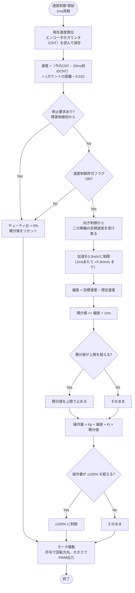

# 04 速度制御

向き制御から受け取った左右の目標速度どおりに、左右の車輪をそれぞれ回す。走行制御の一番内側にあたる。

関連要件：FR-11, FR-12, NFR-01, NFR-02, IF-02

## 機能モジュール表

| 機能モジュール名 | 機能モジュールの役割 | 入力 | 出力 | 動作の仕様 | 関連モジュール |
|---|---|---|---|---|---|
| 現在速度算出 | エンコーダのカウント変化から車輪速度を求める | 左右エンコーダのカウント値 | 左右の現在速度 [mm/s] | 1 ms周期で計算 TIM3/TIM4のエンコーダモードのカウンタ（CNT）を1 msごとに読み、直近11回分を保存 速度 =（今のCNT − 10 ms前のCNT）× 1カウントあたりの距離 ÷ 0.010 差は符号付き16ビット（int16_t）で求め、カウンタの一周に対応 | 速度PI制御 エラー検出 |
| 速度PI制御 | 目標速度と現在速度の差からモータの操作量を決める（左右それぞれ） | 左右の目標速度 [mm/s]（向き制御から） 左右の現在速度 [mm/s] 速度制御許可フラグ | 左右のモータ操作量（デューティ比 [%]） | 1 ms周期で計算 目標速度は加速のみ 0.3 m/s² に制限（1 msあたり +0.3 mm/s まで。減速・停止は制限しない） 操作量は ±100 % で制限 積分値が増えすぎないように上限を設ける | 向きP制御 現在速度算出 モータ駆動 |
| モータ駆動 | 操作量をPWM信号と回転方向に変換してモータドライバへ出力する | 左右のデューティ比 [%] 停止要求（障害物検知から） 速度制御許可フラグ（ストップボタン・エラーでOFF） | PWM信号 回転方向信号 | 操作量が変わったときに出力を更新 停止要求があれば即座にデューティ比を0 % にする | 速度PI制御 障害物検知 状態管理 |

## 決定事項（2026-10-02）

- 目標速度の変化：**加速のみ 0.3 m/s² に制限**（モータ選定の前提。減速・停止要求は制限しないので止まる距離が延びない）
- 車輪ごとの目標速度：0〜600 mm/s（向き制御で制限済み。後退しない）
- 速度制御のKp・Kiは、モータの式と1 msのPIを入れた詳しいモデル（MATLAB）で決める
- 制御で使う速度の単位は **mm/s** にそろえる（角速度には直さない。車輪の速度と角速度は定数倍の関係で、その定数はゲインに含まれる）
- 現在速度は **直近10 ms分のカウント変化** から求める（1 msの変化だけでは数え方の誤差が大きいため）
- 坂道での走行は想定しない

## 単位と換算

| 段 | やり取りする量 | 単位 |
|---|---|---|
| 向き制御 → 速度PI制御 | 左右の目標速度 | mm/s |
| 現在速度算出 → 速度PI制御 | 左右の現在速度 | mm/s |
| 速度PI制御 → モータ駆動 | デューティ比 | % |
| モータ駆動 → モータドライバ | PWM信号と回転方向（平均電圧 = デューティ比 × 12 V） | ― |

駆動系：モータ →（ギヤヘッド 1/36）→ 出力軸 →（歯車 31:20、1.55倍に増速）→ 車輪（外径約65 mm、1周 204.2 mm）。出力軸1回転で台車は 316.5 mm 進む。

### 1カウントあたりの距離（**保留：エンコーダの取り付け位置を確認中**）

支給モータへのエンコーダの付け方（授業の資料・先生の指示）を確認してから確定する。どちらの場合も、10 ms分の変化で速度を求めれば速度精度 ±10 % を満たせる。

| 取り付け位置 | 316.5 mm進む間のカウント（8192カウント/回転の設定） | 1カウントあたりの距離 | 500 mm/s のとき10 msで数えるカウント |
|---|---|---|---|
| 出力軸 | 8192 | 0.0386 mm | 約130（誤差 約±0.8 %） |
| モータ軸（後ろ側の軸が必要） | 8192 × 36 = 294,912 | 0.00107 mm | 約4,700 |

### 車輪の速度とモータの回転数

| 車輪の速度 | 出力軸の回転数 | 余裕 |
|---|---|---|
| 500 mm/s（位置制御の上限） | 94.8 rpm | 定格 123.6 rpm の77 % |
| 600 mm/s（車輪ごとの上限） | 113.7 rpm | 無負荷 137.2 rpm の83 %。定格負荷時はデューティ比 約92 % が必要 |

## PID制御にしなかった理由（PI制御）

- **I（積分）が必要**：モータは電圧に対して速度が一次遅れで落ち着く。摩擦や荷物の重さがあるとP制御だけでは目標速度に届かないまま止まるため、Iでずれを消す。
- **D（微分）が要らない**：一次遅れの対象は振動しにくい。エンコーダから求めた速度は段差状のノイズを含むため、微分すると悪影響が出る。

## 未確定事項

- Kp、Ki、積分値の上限、周期（1 ms は仮）
- **エンコーダの取り付け位置（出力軸かモータ軸か）：確認中のため保留**。決まったら1カウントあたりの距離を確定する
- エンコーダの分解能（AMT102-V のDIPスイッチ設定。上の表は8192カウント/回転で計算）
- モータドライバの型番と入力方式（IN1/IN2型か、PWM＋方向型か）

## フローチャート

左右の車輪それぞれで、その車輪の目標速度を使って同じ処理を行う。

