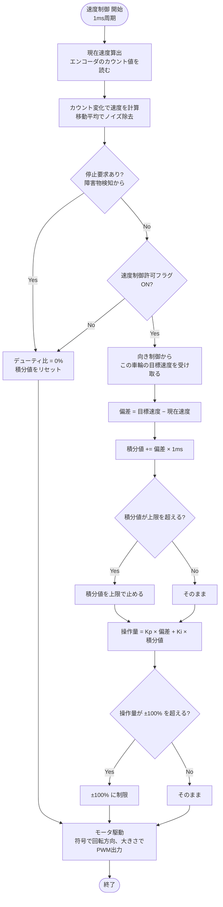

# 04 速度制御

向き制御から受け取った左右の目標速度どおりに、左右の車輪をそれぞれ回す。走行制御の一番内側にあたる。

関連要件：FR-11, FR-12, NFR-01, NFR-02, IF-02

## 機能モジュール表

| 機能モジュール名 | 機能モジュールの役割 | 入力 | 出力 | 動作の仕様 | 関連モジュール |
|---|---|---|---|---|---|
| 現在速度算出 | エンコーダのカウント変化から車輪速度を求める | 左右エンコーダのカウント値 | 左右の現在速度 [mm/s] | 1 ms周期で計算 タイマのエンコーダモードで読み取り、移動平均でノイズを除去 | 速度PI制御 エラー検出 |
| 速度PI制御 | 目標速度と現在速度の差からモータの操作量を決める（左右それぞれ） | 左右の目標速度 [mm/s]（向き制御から） 左右の現在速度 [mm/s] 速度制御許可フラグ | 左右のモータ操作量（デューティ比 [%]） | 1 ms周期で計算 操作量は ±100 % で制限 積分値が増えすぎないように上限を設ける | 向きP制御 現在速度算出 モータ駆動 |
| モータ駆動 | 操作量をPWM信号と回転方向に変換してモータドライバへ出力する | 左右のデューティ比 [%] 停止要求（障害物検知から） 速度制御許可フラグ（ストップボタン・エラーでOFF） | PWM信号 回転方向信号 | 操作量が変わったときに出力を更新 停止要求があれば即座にデューティ比を0 % にする | 速度PI制御 障害物検知 状態管理 |

## PID制御にしなかった理由（PI制御）

- **I（積分）が必要**：モータは電圧に対して速度が一次遅れで落ち着く。摩擦や荷物の重さがあるとP制御だけでは目標速度に届かないまま止まるため、Iでずれを消す。
- **D（微分）が要らない**：一次遅れの対象は振動しにくい。エンコーダから求めた速度は段差状のノイズを含むため、微分すると悪影響が出る。

## 未確定事項

- Kp、Ki、積分値の上限、周期（1 ms は仮）
- エンコーダの分解能（AMT102-V のDIPスイッチ設定）と、カウントから距離への換算（タイヤ外径約65 mm、歯車で1.55倍増速）
- モータドライバの型番と入力方式（IN1/IN2型か、PWM＋方向型か）

## フローチャート

左右の車輪それぞれで、その車輪の目標速度を使って同じ処理を行う。

