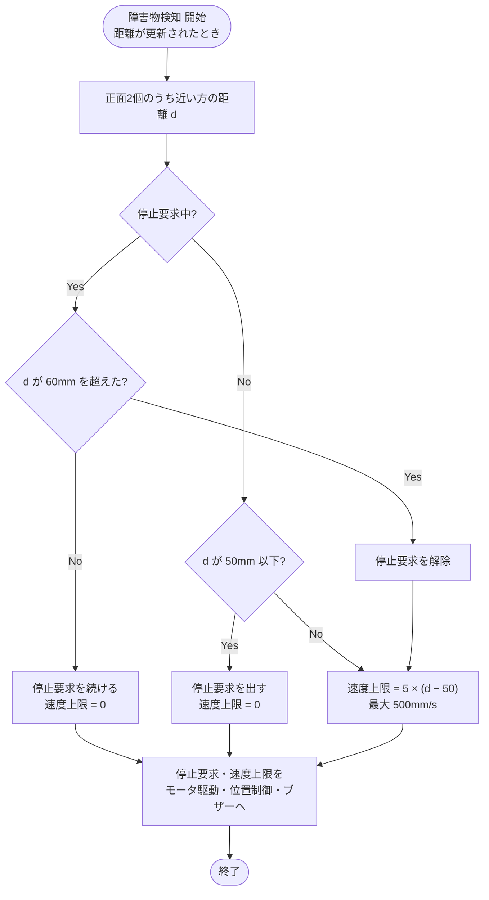
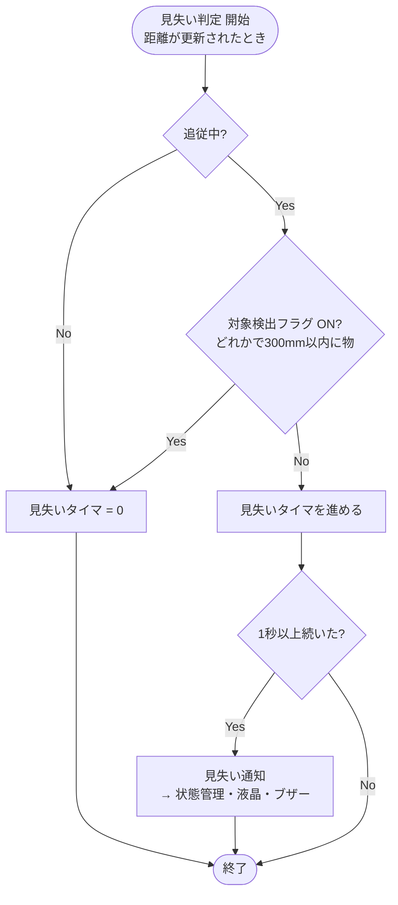
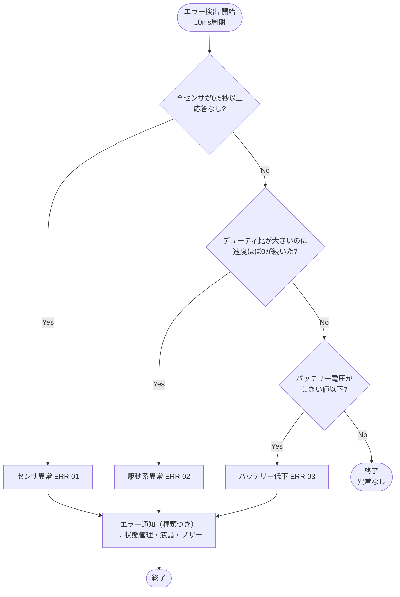

# 05 安全監視

障害物（追従対象を含む）への接近、追従対象の見失い、センサ・駆動系・電源の異常を見つける。

関連要件：FR-05, FR-06, ERR-01〜04

## 機能モジュール表

| 機能モジュール名 | 機能モジュールの役割 | 入力 | 出力 | 動作の仕様 | 関連モジュール |
|---|---|---|---|---|---|
| 障害物検知 | 前方の物に近づきすぎないよう、停止と速度の制限をかける | 正面左・正面右の距離 [mm] | 停止要求 速度上限 [mm/s] | 新しい距離が入るたびに更新 正面2個のうち近い方の距離で判断 50 mm以下で停止要求を出す 60 mmを超えたら解除（ヒステリシス） 速度上限 = 5 × (距離 − 50) [mm/s]、最大 500 mm/s | モータ駆動 位置P制御 ブザー制御 |
| 見失い判定 | 追従対象を見失ったかを判断する | 対象検出フラグ 現在状態 | 見失い通知 | 追従中のみ動作 4個すべてで300 mm以内に物がない状態が1 s（仮）続いたら見失い | 状態管理 液晶表示 ブザー制御 |
| エラー検出 | センサ・駆動系・電源の異常を見つける | 応答なしフラグ デューティ比 [%] 現在速度 [mm/s] バッテリー電圧 [V]（測る場合） | エラー通知（種類つき） | 10 ms周期で確認 センサ異常（ERR-01）：応答なしが0.5 s続いたらタイムアウト。全センサが同時に異常な場合のみエラー確定 駆動系異常（ERR-02）：デューティ比が大きいのに速度がほぼ0の状態が続く（閾値TBD） バッテリー低下（ERR-03）：電圧がしきい値以下（TBD） | 状態管理 液晶表示 ブザー制御 |

## 補足・未確定事項

- ERR-04（障害物検知）は追従対象と区別せず、障害物検知モジュールで近接停止として扱う案。
- 近接停止の距離は50 mm（班の運用方針）。要件定義書10章の確認待ち事項に反映する。
- バッテリー電圧の測定には分圧してADCで測る回路が必要。PDトリガーは電池が減っても出力が12 Vのまま保たれるため、低下を検出しにくい可能性がある。
- 見失いの秒数、速度上限の傾き、ERR-02の各閾値は実機検証後に決める。

## フローチャート

### 障害物検知

### 見失い判定

### エラー検出

