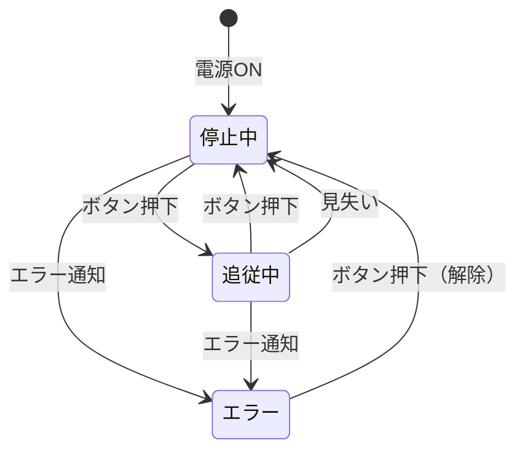
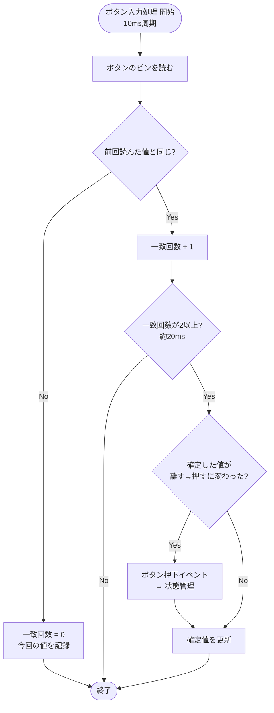
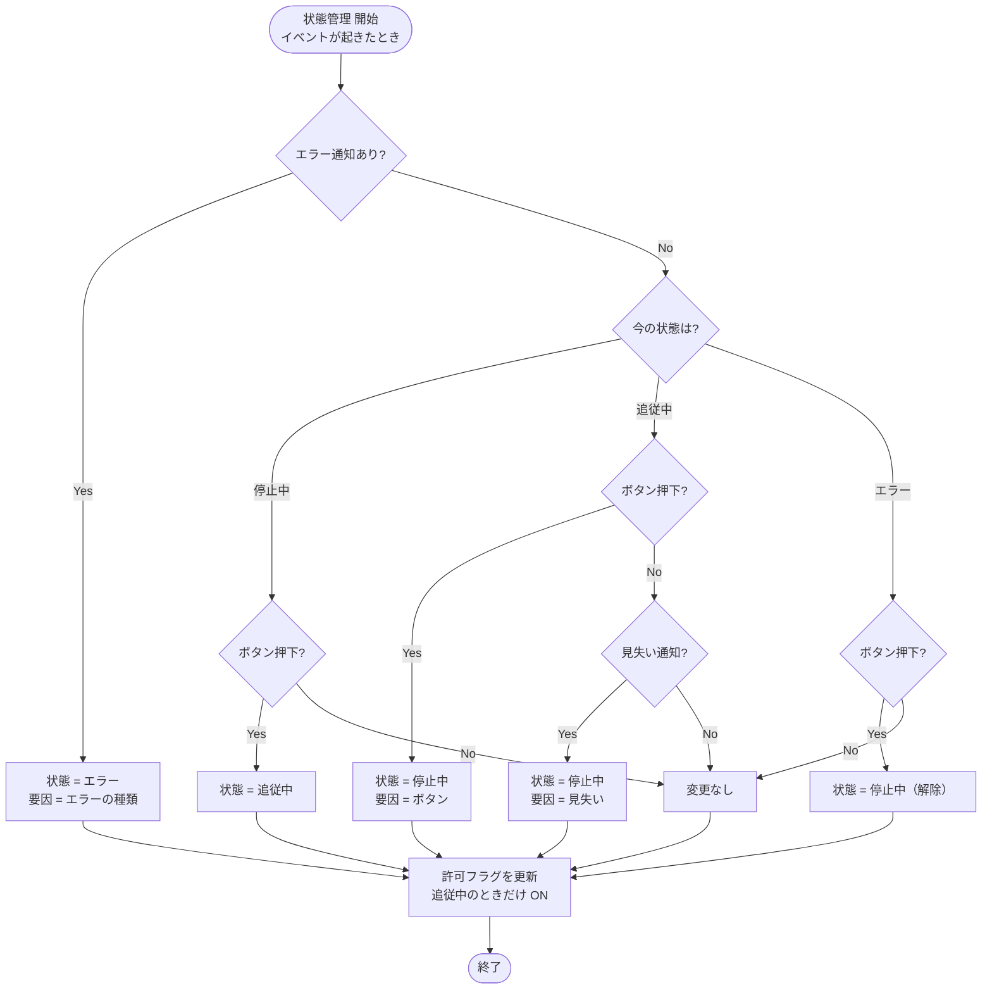

# 06 状態管理・ボタン入力

スタート／ストップボタン（1個、押すたびに開始・停止を切り替え）の入力と、台車の状態（停止中／追従中／エラー）を管理する。

関連要件：FR-07, FR-15, NFR-08, IF-05

## 機能モジュール表

| 機能モジュール名 | 機能モジュールの役割 | 入力 | 出力 | 動作の仕様 | 関連モジュール |
|---|---|---|---|---|---|
| ボタン入力処理 | ボタンが押されたことを検出する | ボタンのピンの状態（押すとLow、内蔵プルアップ） | ボタン押下イベント | 10 ms周期で読み取り 2回続けて同じ値なら確定（約20 msのチャタリング防止） 離れた状態から押された状態に変わった瞬間だけイベントを出す | 状態管理 |
| 状態管理 | 台車の状態を管理し、各モジュールに動作の許可を出す | ボタン押下イベント 見失い通知 エラー通知 | 現在状態（停止中／追従中／エラー） 停止要因（ボタン／見失い／エラーの種類） 位置制御許可フラグ 速度制御許可フラグ | イベントが起きたときに状態を切り替える 停止中＋ボタン → 追従中 追従中＋ボタン → 停止中 追従中＋見失い → 停止中 エラー通知 → どの状態からでもエラー エラー＋ボタン → 停止中（解除） 追従中のときだけ両方の許可フラグをON | 位置制御 速度制御 液晶表示 ブザー制御 |

## 補足・未確定事項

- 障害物で止まっている間も状態は「追従中」のまま（停止要求でモータだけ止め、離れたら自動で再開）。
- エラーの後はいきなり再開せず、ボタンで「停止中」に戻してから、もう一度押して開始する（手動リセット）。要件定義書11章「エラー時の復帰条件」の案。
- 基本走行（直進・周回、FR-13・FR-14）と追従の切り替えをどう入れるかは TBD。決まったら状態を追加する。

## 状態遷移図

## フローチャート

### ボタン入力処理

### 状態管理

