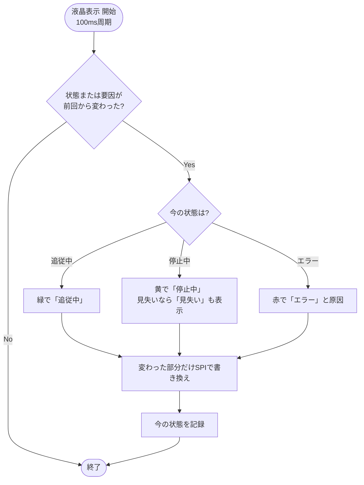
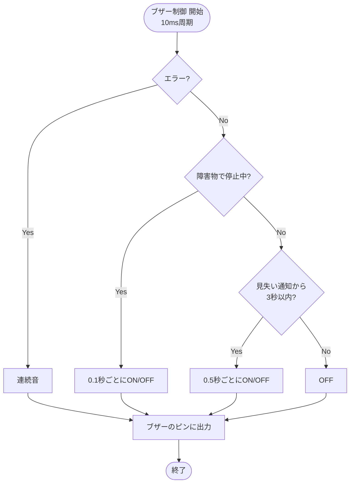

# 07 表示・報知

台車の状態を液晶（ILI9341 2.8インチ、SPI）とブザー（UDB-05LFPN、トランジスタ2SC1815で駆動）で知らせる。

関連要件：FR-08, FR-09, FR-10, IF-03, IF-04

## 機能モジュール表

| 機能モジュール名 | 機能モジュールの役割 | 入力 | 出力 | 動作の仕様 | 関連モジュール |
|---|---|---|---|---|---|
| 液晶表示 | 現在の状態を文字と色で表示する | 現在状態 停止要因・エラーの種類 | 液晶への描画データ（SPI） | 100 ms周期で確認し、状態が変わったときだけ書き換える 追従中：緑で「追従中」 停止中：黄で「停止中」（見失いのときは「見失い」も表示） エラー：赤で「エラー」と原因 | 状態管理 |
| ブザー制御 | 見失い・障害物・エラーを音で知らせる | 現在状態 見失い通知 停止要求（障害物） エラー通知 | ブザーのON／OFF信号 | 10 ms周期で鳴らし方を更新 エラー：連続音 障害物で停止中：0.1 sごとにON／OFF 見失い：0.5 sごとにON／OFF（3 sで止める、仮） 重なったときはエラー → 障害物 → 見失いの順で優先 | 状態管理 障害物検知 見失い判定 エラー検出 |

## 補足・未確定事項

- 表示器はLED板から液晶に変更した（要件定義書 FR-08・IF-03 の「LED板」を「表示器（液晶）」に更新する必要あり）。
- 液晶はフォント非搭載のため、「追・従・中・停・止・エ・ラ・ー」（「見失い」を出すなら「見・失・い」も）の文字データを用意する。
- 画面全体はRAMに持たず、変わった部分だけ書き換える（RAM 128 KB のため）。
- 見失い時に鳴らす長さは TBD。

## フローチャート

### 液晶表示

### ブザー制御

