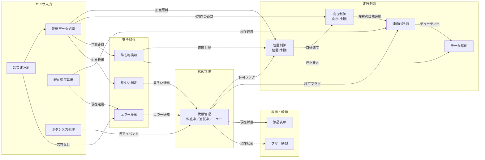

# モジュール設計（機能モジュール一覧）

移動台車のソフトウェアを機能モジュールに分け、各モジュールの役割・入出力・動作仕様とフローチャートをまとめる。
要件は [ソフトウェア要件定義書](../software_requirements.md) を参照。

> **状態：案（2026-10-02）**。周期・しきい値・ゲインには仮の値（TBD）を含む。

## ドキュメント一覧

| No. | ドキュメント | 含むモジュール | 主な関連要件 |
|---|---|---|---|
| 01 | [超音波計測](01_ultrasonic.md) | 超音波計測、距離データ処理 | FR-01, FR-02, IF-01 |
| 02 | [位置制御](02_position_control.md) | 追従対象距離取得、追従距離設定、位置偏差計算・位置P制御 | FR-03, FR-04, NFR-03 |
| 03 | [向き制御](03_direction_control.md) | 左右ずれ判定、向きP制御 | FR-03, FR-11 |
| 04 | [速度制御](04_speed_control.md) | 現在速度算出、速度PI制御、モータ駆動 | FR-11, FR-12, NFR-01, NFR-02, IF-02 |
| 05 | [安全監視](05_safety_monitor.md) | 障害物検知、見失い判定、エラー検出 | FR-05, FR-06, ERR-01〜04 |
| 06 | [状態管理・ボタン入力](06_state_management.md) | ボタン入力処理、状態管理 | FR-07, FR-15, IF-05 |
| 07 | [表示・報知](07_display_notification.md) | 液晶表示、ブザー制御 | FR-08, FR-09, FR-10, IF-03, IF-04 |

## 全体構成（モジュール間のデータの流れ）

位置制御 → 向き制御 → 速度制御 の順に目標値を渡して走行し、安全監視と状態管理が許可・停止を出す。

## 処理の周期（案）

| 周期 | 処理 |
|---|---|
| 1 ms（タイマ割込み） | 現在速度算出、速度PI制御、モータ駆動 |
| 10 ms（タイマ割込み） | ボタン入力処理、エラー検出、ブザー制御 |
| 60 ms（2個同時測定のスロット） | 超音波計測、距離データ処理（1周120 ms、各センサ120 msごと） |
| 正面距離の更新ごと（60 ms） | 位置制御、向き制御、障害物検知、見失い判定 |
| 100 ms | 液晶表示 |
| イベント発生時 | 状態管理 |

## 表の書き方

各ドキュメントの機能モジュール表は次の列で書く。

| 列 | 内容 |
|---|---|
| 機能モジュール名 | モジュールの名前 |
| 機能モジュールの役割 | 何をするモジュールか |
| 入力／出力 | 受け取る値・出す値（単位つき） |
| 動作の仕様 | 周期、計算式、しきい値 |
| 関連モジュール | 入出力でつながるモジュール |
